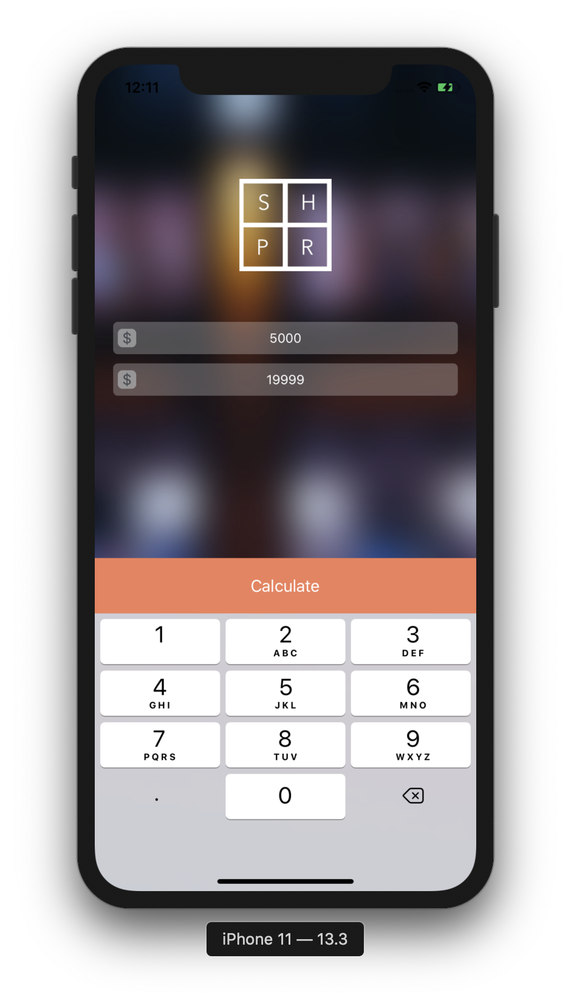
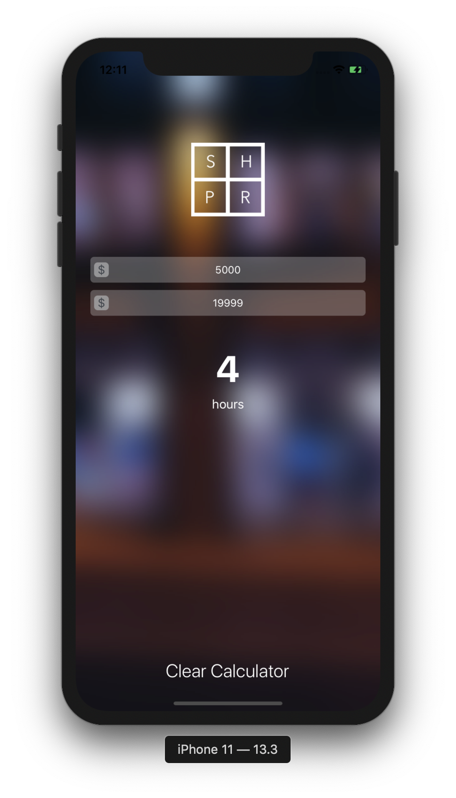

# window-shopper
Computes how many hours you need to render before you can buy an item.

- custom textfield (CurrencyTextField.swift)
- programatically added button attached to decimal keyboard (MainVC.swift - inputAccessoryView)
- unit testing (window_shopperTests.swift - Editor > Add Target > Unit Testing Bundle)

